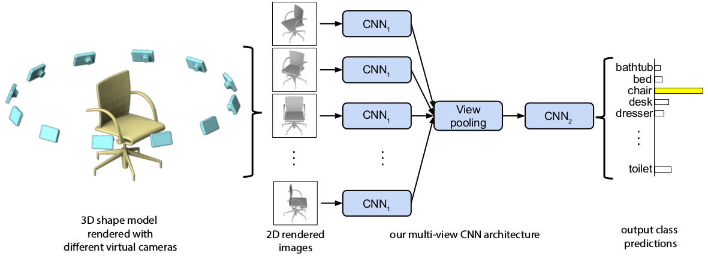

# texture-classification
texture classification deep learning

## Data
- 

## Quick Start
- prepare multi-view image
- execute train.py

## Evaluation
- classification

## TODO
- Texture classification research
- color balancing research
- ...

## References from
- https://github.com/WeiTang114/MVCNN-TensorFlow

